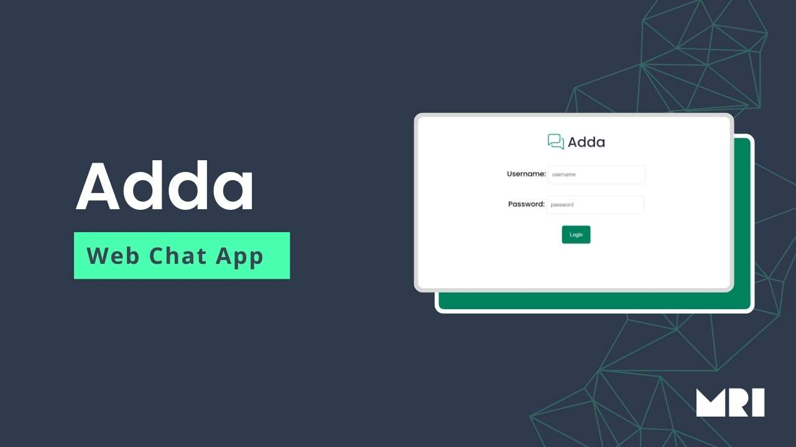

# Adda: Real-time Web Chatting Application

Adda is a dynamic web chatting repository developed using Flask and Socket.IO, providing users with the flexibility to seamlessly join existing chat rooms or create new ones based on their preferences. With Adda, users can engage in real-time conversations with others, fostering communication and collaboration in various contexts.

## Key Features:
- **Chat Room Creation:** Users have the ability to create chat rooms tailored to their needs. They can specify the size of the room, ensuring optimal interaction and engagement.
- **Room Customization:** Adda allows users to customize their chat rooms according to their preferences, creating a personalized environment for discussions.
- **Real-time Communication:** Leveraging the power of Socket.IO, Adda enables real-time communication among users within the same chat room, facilitating seamless interaction and instant messaging.
- **User-friendly Interface:** Adda boasts an intuitive and user-friendly interface, ensuring a smooth and enjoyable chatting experience for all users.

## Technologies Used:
- **Flask:** Adda is built on the Flask web framework, providing a robust foundation for developing scalable and efficient web applications.
- **Socket.IO:** Socket.IO powers real-time, bidirectional communication between the client and server, enabling instant messaging and updates within Adda's chat rooms.

## How to Get Started:
1. Clone the Adda repository to your local machine.
2. Install the necessary dependencies using `pip install -r requirements.txt`.
3. Run the Flask application using `python app.py`.
4. Access Adda through your preferred web browser.

## Contribution Guidelines:
- Fork the repository and create a new branch for your feature or bug fix.
- Ensure adherence to the project's coding style and guidelines.
- Submit a pull request detailing the changes made and the problem solved.

## Future Enhancements:
- **User Authentication:** Implement authentication features to secure chat rooms and authenticate users.
- **Enhanced Room Management:** Add functionalities for room moderation, such as kicking users and managing permissions.
- **Improved UI/UX:** Continuously enhance the user interface and experience to provide a more visually appealing and intuitive chatting environment.

## Credits
Developed by [Md. Rubayet Islam](https://github.com/feedofmri)

## License:
This project is licensed under the [MIT License](LICENSE).

## Acknowledgements:
Special thanks to the creators and maintainers of Flask and Socket.IO for their invaluable contributions to the open-source community.
